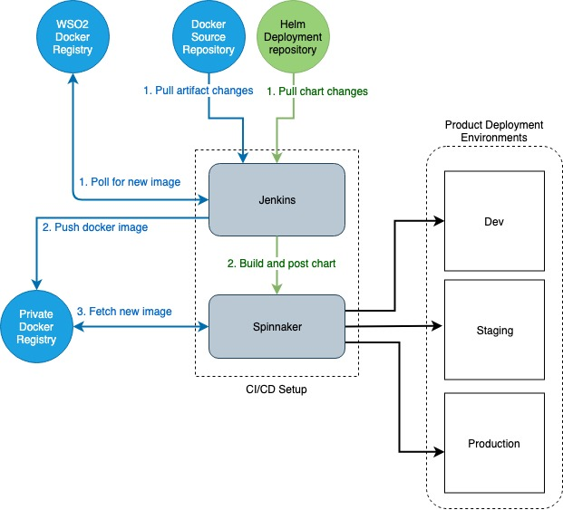

# HELM resources for WSO2 kubernetes pipelines

The setup consists of Jenkins and spinnaker. It can be deployed on top of Kubernetes and deployed using HELM which makes it easier to configure, install, scale and upgrade (Refer Installation Instructions at the bottom). In addition to the tools, jenkins jobs and spinnaker pipelines for each specified product are preconfigured, which makes getting started hassle-free.

Use the `wso2-cd` helm chart to deploy a jenkins instance that could handle the CI/CD operations for WSO2 products.




The diagram above illustrates the setup. We make use of Spinnaker as a deployment tool and Jenkins as an integration tool. 

In order to create or upgrade product deployments, Spinnaker expects a chart and/or docker image(s). These artifacts are provided in the three different flows explained below
1. The HELM chart is stored in a git repository and jenkins polls for changes in the chart. Once change is detected, a predefined jenkins job will build the HELM chart(.tgz) and post it to spinnaker as Webhook.
2. A weekly cron job in Jenkins will build a new docker image from the latest WSO2 image and push it to the private registry in Dockerhub to which Spinnaker will be listening to.
3. The artifact repository contains the docker resources required to build the product docker image. This includes the Dockerfile and artifacts. A change to the repository will trigger a build of a new image based on the weekly image.

Each environment would have a corresponding Spinnaker pipeline (dev, staging, production). Every new change will be deployed to dev instantly, however the promotion to the staging and above environments needs manual approval which will trigger the pipelines to respective environments.

## Installation and Configuration

### Prerequisites

1. Create repositories in Dockerhub for image(s) and push an initial image with the tag `latest`.
    ```shell
    docker pull docker.wso2.com/wso2is:5.8.0
    docker tag docker.wso2.com/wso2is:5.8.0 <DOCKER_ORGANIZATION>/wso2is
    docker push <DOCKER_ORGANIZATION>/wso2is
    ```
2. Create git repo(s) with the Dockerfiles to build each image. The Dockerfiles should contain the following line.
    ```Dockerfile
    FROM <BASE>
    ```
3. Create a Git repo containing the following
    * Values files for each environment (values-dev.yaml, values-staging.yaml, Values-prod.yaml). These should override the default WSO2 images to use the private repositories that was created in step 1. Centralized logging should also be enabled, pointing to the elasticsearch master at `jenkins-elasticsearch-client.wso2.svc.cluster.local` and indexNodeID to be used for indexing logs.
        ```yaml
        wso2:
            deployment:
                wso2is:
                    dockerRegistry: "index.docker.io/aaquiff"
                    imageName: "wso2is"
                    imageTag: ""
            centralizedLogging:
                enabled: true
                elasticsearch:
                    host: jenkins-elasticsearch-client.wso2.svc.cluster.local
                indexNodeID:
                    wso2ISNode: "wso2is-dev-node"
        ```
    * A shell script that is run in the staging environment before the changes are ready to be pushed to the production environment. It's preferable to have this in a folder name `tests` at the root of the repository.
4. Complete the values.yaml for the chart by following the [guide](#Values)
### Quick Start Guide

Use the helm chart from WSO2 helm chart repository.
```
helm install --name <RELEASE_NAME> wso2/wso2-cd -f values.yaml --namespace wso2
```

## Considerations

* Nodes in the cluster should have docker installed as the jenkins pod will bind to the docker socket on the node it's running on.

## Values

The values template could be obtained using the following command.
```
helm inspect wso2/wso2-cd > values.yaml
```

